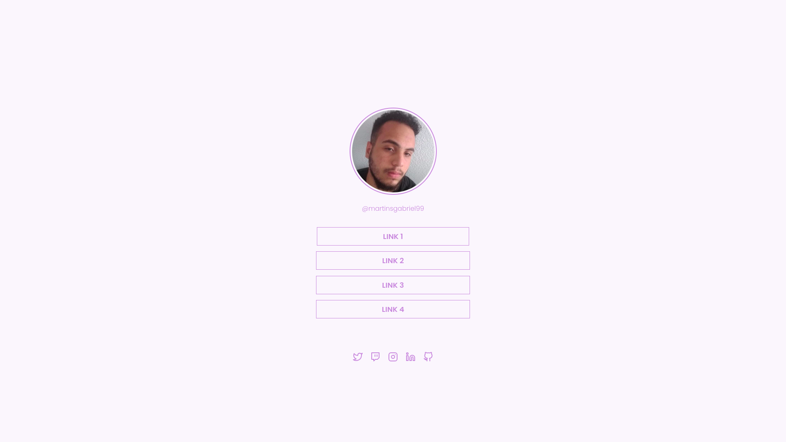

<h1 align="center">Social Tree</h1>

  
  

 

  

  Desafio do Discover de social tree

## :computer: Projeto:

 

Esse desafio consiste em criar um social tree, para treinar todo o conhecimento adquirido nos cursos **Guia Estelar de HTML e CSS**.

## :rocket: Tecnologias utilizadas:

* HTML
* CSS